## Part 1. Получение метрик и логов

В ```pom.xml``` в booking, gateway, session и report подключила Micrometer:

```
<dependency>
            <groupId>io.micrometer</groupId>
            <artifactId>micrometer-registry-prometheus</artifactId> 
        </dependency>
```

В ```application.properties``` сервисов добавила следующие строки:


```
management.endpoints.web.exposure.include=*
management.endpoint.metrics.enabled=true

```


#### В booking-service ```/booking-service/src/main/java/com/s21/devops/sample/bookingservice/Statistics/QueueProducer.java``` был добавлен сбор следующих метрик:

количество отправленных сообщений в rabbitmq;       ("rabbitmq_messages_sent_total")
    
количество бронирований     ("booking_total")

```java

@Autowired
    public QueueProducer(MeterRegistry meterRegistry) {

        this.sentMessagesCounter = Counter.builder("rabbitmq_messages_sent_total")
                .description("Total messages sent to RabbitMQ")
                .register(meterRegistry);

        this.bookingsCounter = Counter.builder("booking_total")
                .description("Total number of bookings created")
                .register(meterRegistry);
    }

```

#### В gateway-service был создан файл ```src/main/java/com/s21/devops/sample/gatewayservice/Service/MetricsCollector.java``` и был добавлен сбор следующих метрик:

количество полученных запросов на gateway       ("gateway_requests_total")
    
    
```java

@Component
public class MetricsCollector {

    private final Counter gatewayRequests;

    @Autowired
    public MetricsCollector(MeterRegistry meterRegistry) {
        this.gatewayRequests = Counter.builder("gateway_requests_total")
                .description("Total requests to gateway")
                .register(meterRegistry);
    }

    public void incrementRequestReceived() {
        gatewayRequests.increment();
    }
}

```

В файл ```/gateway-service/src/main/java/com/s21/devops/sample/gatewayservice/ControllerGatewayController.java``` была добавлена строка ```import com.s21.devops.sample.gatewayservice.Service.MetricsCollector```

#### В report-service ```/report-service/src/main/java/com/s21/devops/sample/reportservice/Statistics/QueueConsumer.java``` был добавлен сбор следующих метрик:

количество обработанных сообщений в rabbitmq;       ("rabbitmq_messages_processed_total")
    
    
```java

    @Autowired
    public QueueConsumer(MeterRegistry meterRegistry) {
        this.processedMessagesCounter = Counter.builder("rabbitmq_messages_processed_total")
                .description("Total RabbitMQ messages processed")
                .register(meterRegistry);
    }
```


#### В session-service ```/session-service/src/main/java/com/s21/devops/sample/sessionservice/Service/SessionServiceImplementation.java``` был добавлен сбор следующих метрик:

количество полученных запросов на авторизацию пользователей     ("auth_requests_total")
    
```java

 @Autowired
    public SessionServiceImplementation(MeterRegistry meterRegistry) {
        this.authRequestsCounter = Counter.builder("auth_requests_total")
                .description("Total authorization requests")
                .register(meterRegistry);
    }
```


Собрала и выгрузила образы в Docker Hub


Взяла Vagrantfile из прошлого проекта, на manager открыла порты для Grafana и Prometheus

```
manager.vm.network "forwarded_port", guest: 9090, host: 9090
    manager.vm.network "forwarded_port", guest: 3000, host: 3000
```

Настроила ssh-соединение между машинами, добавила их в swarm

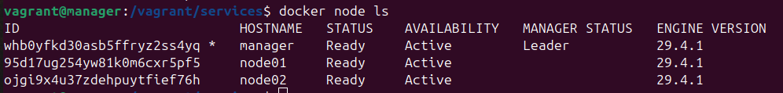


В ```docker-stack.yml``` добавила сервисы node-exporter, cadvisor, blackbox-exporter, loki, promtail, grafana, prometheus. Конфиги лежат в ```src/services```.

На manager запустила стек

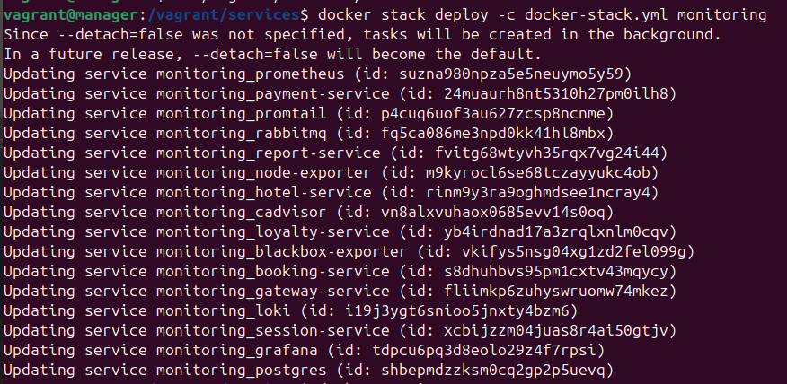

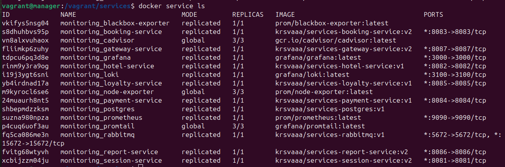

По адресу ```http://localhost:9090/targets``` отображается статус сервисов:

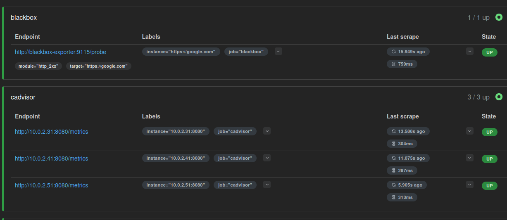

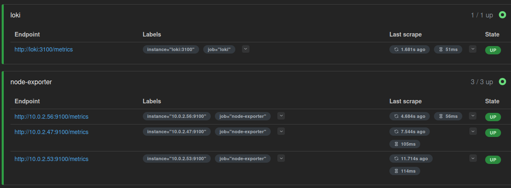

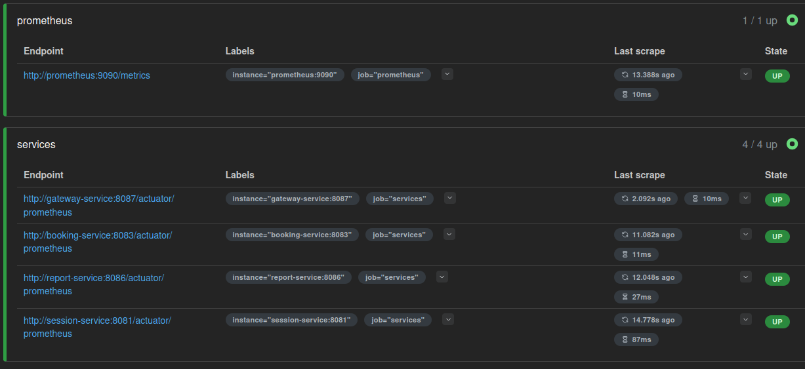


## Part 2. Визуализация

Создала дашборд в Grafana, предварительно добавив в data sources Prometheus и Loki

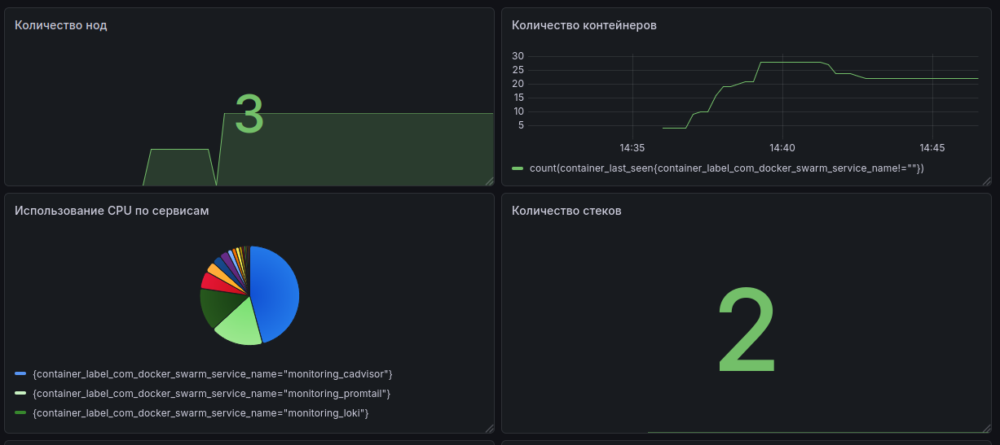

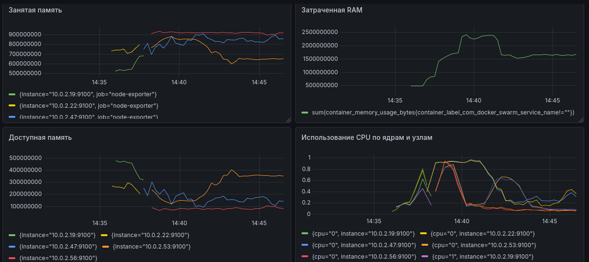

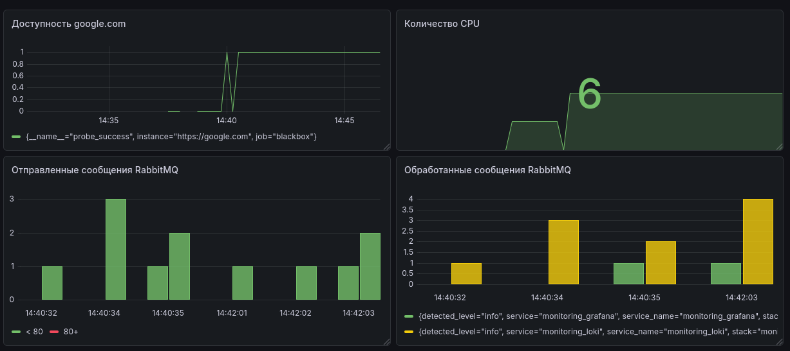

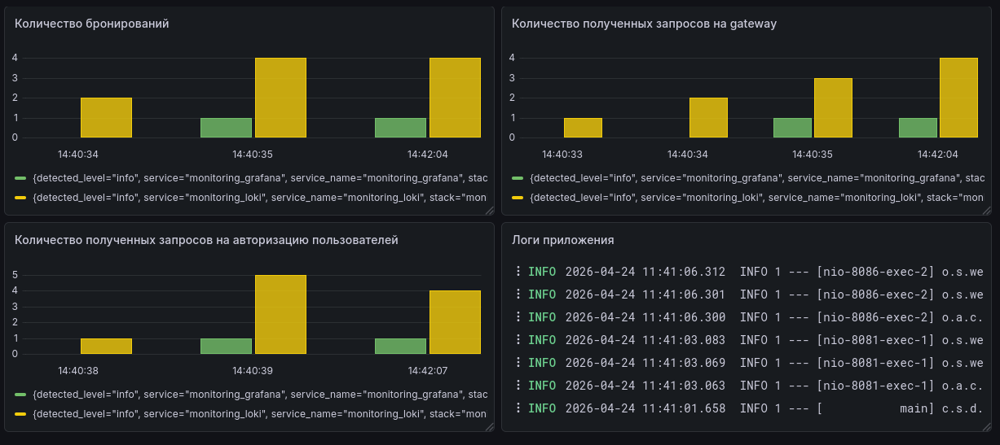


## Part 3. Отслеживание критических событий

Добавила AlertManager в стек, написала конфиг ```services/alertmanager/alertmanager.yml```, добавила список алертов в ```services/prometheus/alerts.yml```

Получение уведомлений по почте:

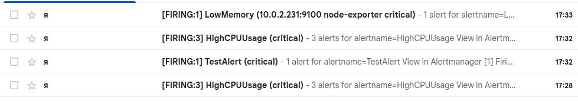

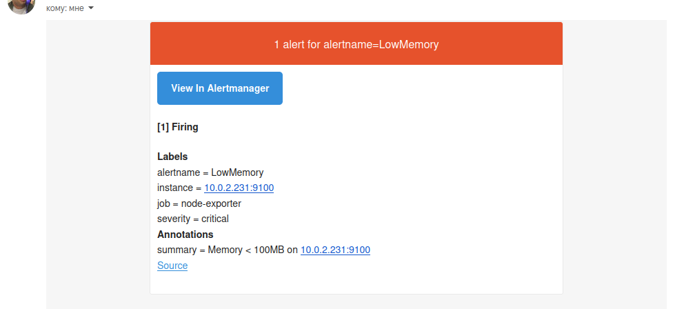


Создала бота в тг и добавила в стек сервис ```telegram-bot```. Добавила бота в ```alertmanager.yml```.

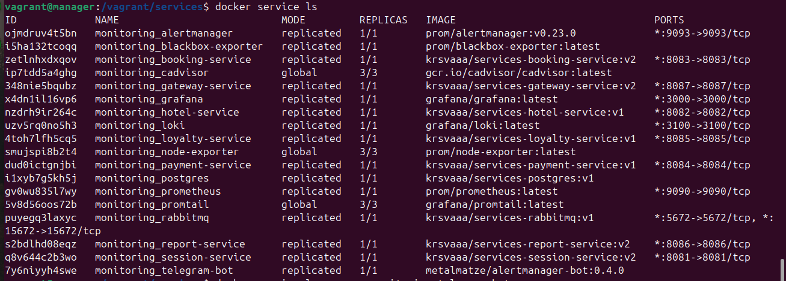

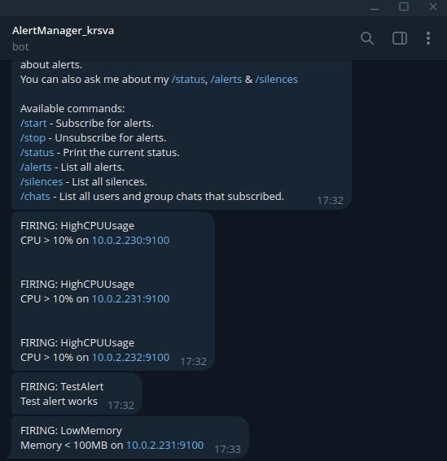

